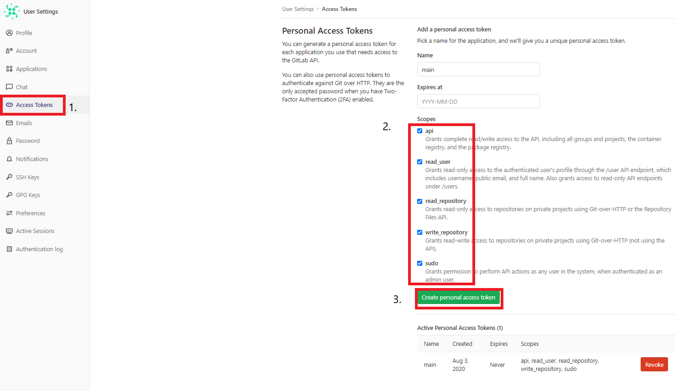
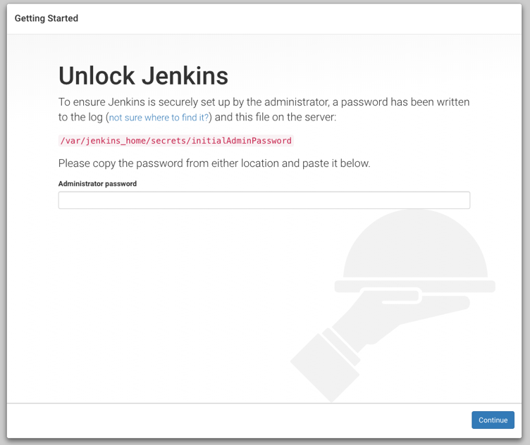
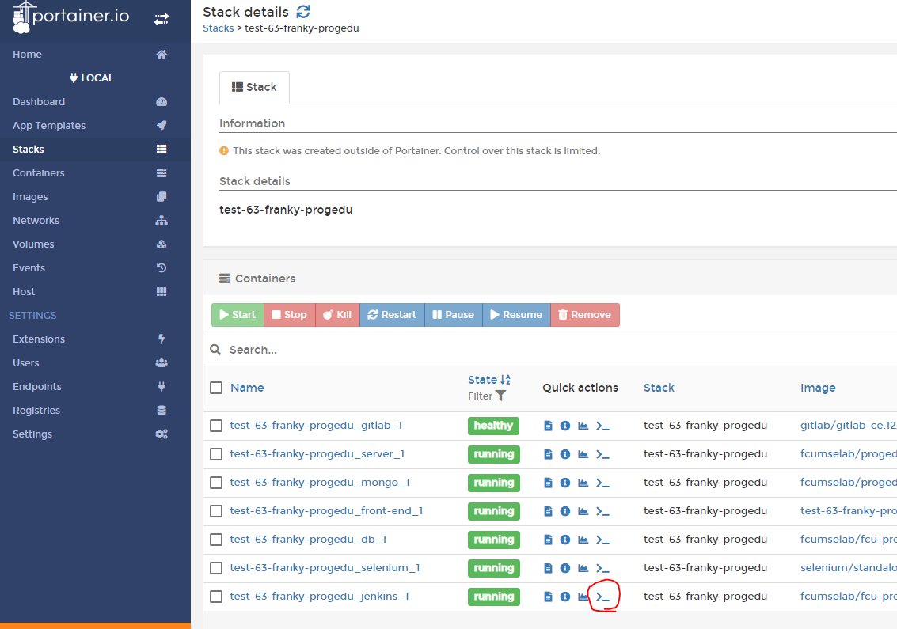
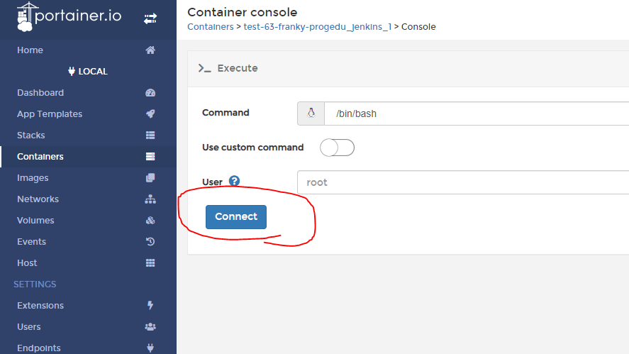
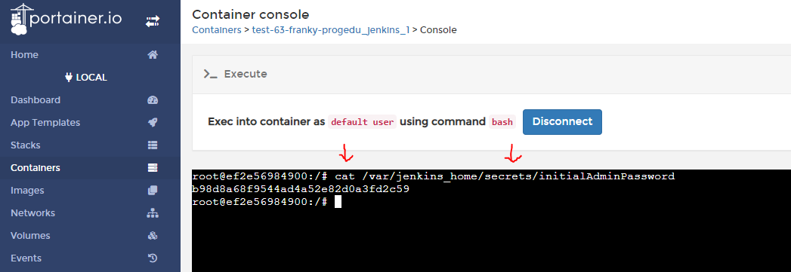

# 部屬流程教學
## 首先確認機器上是否有 `docker-compose` 與 `docker` 軟體
```
docker-compose -version // 1.26.0
docker -v // 19.03.11
```
最新可以用到 ubuntu 20.04 版
docker storage driver 只支援 aufs

## 初步部屬步驟
1. 在linux系統中 clone 此專案後, cd進入專案的根目錄
```
git clone --branch master https://github.com/fcumselab/ProgEdu.git ProgEdu
cd ProgEdu
```

2. 將 `env-example`檔案改名成 `.env` (注意是 "點 env" ), 並編輯它, 它將用來作為建置的設定。
   
   1. 更改 `COMPOSE_PROJECT_NAME=progedu`, 後面的`progedu`可以修改成`yourname-progedu`,(注意:一定要是小寫), 這是表示這群容器的唯一識別ID, 所以如果同一電腦部屬了兩組ProgEdu, 則這變數必須不一樣, 才不會有衝突。
   2. 修正 `GITLAB_HOST=http://example.com:22080` 成 
   `GITLAB_HOST=http://<你電腦的IP地址>:22080`。(22080 需要與 `.env` 裡的 `GITLAB_HTTP_PORT`設定一致)。
   
   3. 如上一步, 修正其它像右邊這種特徵的網址 `http://example.com` 成實際上ProgEdu要架設到的地方, 記得每個服務的 port 都要跟網址後面的 port 一致, 像是 `JENKINS_PORT=8080` 與 `WEB_JENKINS_URL=http://example.com:8080`,可以注意到後面的8080是一樣的, 所以如果因為port號被占用, 而想要把port號更換成38080, 則這兩個的設定要一起更改為 `JENKINS_PORT=38080` 與 `WEB_JENKINS_URL=http://example.com:38080` 。

## 

3. 安全性設定的重要細節 : 
   
   1. 如果要更改資料庫密碼, 則 `DB_PASSWORD` 和 `DB_ROOT_PASSWORD` ,必須設定一樣。
   2. `GITLAB_ROOT_PASSWORD` 是`server`的root的密碼, 也是`GitLab`的root的密碼。
   3. 補充上述, `server`是指ProgEdu的主要網站服務。
   
## 

4. 在專案的根目錄執行 `sudo docker-compose up -d` 即可完成初步建置。

5. 初步建置步驟結束,接下來需要各別設定 GitLab 和 Jenkins 的權限，這樣ProgEdu才能跟這兩個服務連動。

## **設定 GitLab 流程**
### 1. 登入
用瀏覽器依照 `.env`裡的 `GITLAB_HOST` 的網址進入GitLab，
使用者名稱為root，密碼為 `GITLAB_ROOT_PASSWORD`對應的值
### 2. 複製GitLab Token 
右上方頭像進入 > `Preferences` ,在左邊導覽列找到 `Account Tokens`後， 
可設定Name為main, Expires不用設定,
接著全部權限打勾, 接著按下`Create personal access token`, 將產生的 **GitLab Token** (在網頁上半部 的 Your new personal access token 欄位)



輸入到`.env`的 `WEB_GITLAB_ADMIN_PERSONAL_TOKEN`的值,如下範例 
`WEB_GITLAB_ADMIN_PERSONAL_TOKEN=wek213wlkawjrlamsdkfa`

## **設定 Jenkins 流程**  

1. 依`.env`的`WEB_JENKINS_URL`所設定的網址進入Jenkins 
2. 解鎖Jenkins
```
// 輸入以下指令拿password，後把拿到的password, 填入下方輸入區
bash getJenkinsUnlockPassword.sh
```


補充: 解鎖Jenkins的另一種方式

利用portainer 解鎖 Jenkins

step1: 切換至連接頁面



step2: 連接且進入容器



step3:
輸入: `cat /var/jenkins_home/secrets/initialAdminPassword`



============補充結束======================


3. 安裝plug-in 選擇"Install suggested plugins"
  

4. 填上使用者資訊 
  

這裡的名稱 跟密碼 設定必須跟 `.env` 的設定 一致
所以你要先查看你的`.env`。 例如下面例子的`.env`
```
WEB_JENKINS_ADMIN_USERNAME=admin
WEB_JENKINS_ADMIN_PASSWORD=admin
```
則在此例下, 就必須設定Jenkins的帳號: `admin`, 密碼: `admin`
, 按下 `Save and Finish`
接著持續按下一步， 與登入, 就會完成初步的Jenkins架設流程,
還剩幾步驟是為了拿權限。

5. 拿取**Jenkins Token** 
因為ProgEdu要跟Jenkins做溝通 所以需要 **Jenkins Token**

右上角點選 `使用者名稱 > 設定 > API Token > Add new Token > Generate > 複製Token > 儲存`
  

拿到**Jenkins Token**後填入 `.env` 檔的
`WEB_JENKINS_API_TOKEN=` 的等號右邊。

6. 開啟讀取權限
因為ProgEdu需要用它提供的API來讀取`Jenkins`建置完成的檔案。

`管理jenkins > 設定全域安全性中 > 打勾 Allow anonymous read access > 儲存`


7. 設定 **GitLab API Token**

因為jenkinsc會跟GitLab請求程式碼，所以必須給他gitlab的token。
   1. `管理Jenkins > 設定系統` 找到 GitLab後，
先把(Enable authentication for ... connection) 的勾取消
   2. 設定 Connection name = gitlab
   3. 設定 GitLab host URL 為`.env`文件設定的 gitlab 網址
  
   補充:如果在Jenkins找不到設定 **GitLab API Token**的地方，要檢查Jenkins版本和Jenkins套件版本有沒有太舊。

   4. 設定 Credentials:  如下步驟
      1. 按 Add > Jenkins
      2. Kind = GitLab API token
      3. Scope = Global
      4. API token填上 你之前存在`.env`的 **GitLab Token**
      5. ID = gitlab_api
      
        
      
      6. 新增後把Credentials 換成 `GitLab API token` 
      7. 點擊Test Connection測試是否成功
      8. **儲存**
      9. 可以在jenkins -> Credentials 發現你剛剛設定的憑證
## 

8. 把GitLab帳密設定給Jenkins
    
   1. 管理Jenkins > Manage Credentials
    
   2. 在Stores scoped to Jenkins 下方的第一欄位的Jenkins(也就是它左邊有個房子的圖標), 按該Jenkins的連結
   
   3. 按一下 Global credentials (unrestricted) 連結
   
   4. 按一下 在左上角的 Add Credentials
   
   5. 進入以下畫面
   

   - Username：{GitLab root username} (在你剛剛設定的.env找)
   - Password：{GitLab root password} (在你剛剛設定的.env找)  
   - ID: 必須是 **gitlab_root**  
   
   6. 按OK

## 

## 設定後端

 1. 在linux系統中，cd進入後端的config資料夾中

    ```
    cd /server_spring/src/main/resources/config/
    ```

2. 將所有`.example`結尾的檔案改名(去掉`.example`)，並編輯它，它將為後端的相關建置。

   i. 將`course_config.properties.example`，改名為`course_config.properties`，並依照在`.env`中的設定，填入課程相關資訊與TOMCAT IP地址。

   ii. 其他config檔案也是依照在`.env`中的設定填入，總共五個檔案都需要修改。

## 

## 設定完成
### 重新佈署server服務
1. 儲存.env檔，接著重新下 `docker-compose up -d` 指令，目的是用新的設定重新建置一次

### 登入ProgEdu系統
1. 使用 `.env` 所設定的埠號 `FRONT_END_PORT`, 搭配電腦IP進入系統前端頁面  
2. 輸入帳號: root, 密碼: `.env` 的 `GITLAB_ROOT_PASSWORD` 的值

## 推薦開發ProgEdu的重要工具
* MobeXterm => 用ssh來連線linux
* GitKraken => 版本控制
* Postman => 測試web API功能
* MySQL workbench => 用來查看資料庫

## 學習過程推薦
1. Docker > Docker Compose > MySQL > RESTful API >  GitLab > Jenkins > JAVA > Maven > NodeJS > NPM
