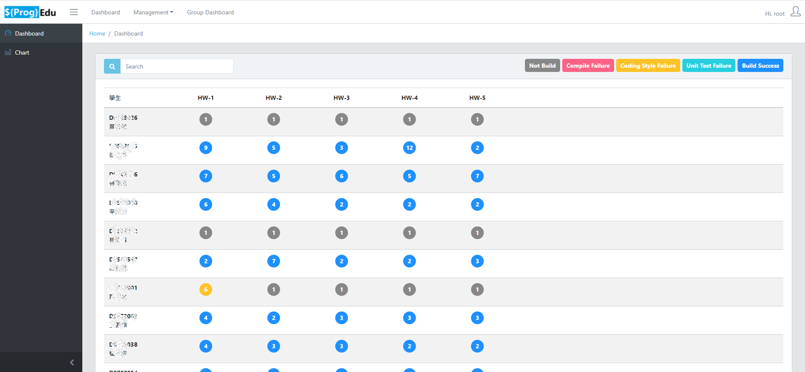

## 什麼是ProgEdu?

ProgEdu 是一套能自動檢查, 編譯, 單元測試, 上傳到系統中的專案,
舉例來說, 當一份Maven專案上傳到該系統, 則ProgEdu就會自動觸發 `Checkstyle`, `Unit Test`, 最終顯示檢查結果, 是否有符合程式碼排版規定, 或是否有通過單元測試。

## 支持的專案類型
* Maven  (Java作業)
* Nodejs (Web作業)

## 何時使用ProgEdu
可以用在教學上, 方便老師查看作業的繳交進度。
目前已經實施的場合為 大學生的Java物件導向課程,
由老師出一份Maven作業, 而當學生做完作業上傳後,
老師可以從 Dashboard 上看見所有的作業完成度,
如下:

## 相關影片介紹系統
* [老師 建立作業流程](https://www.youtube.com/watch?v=n4uM1-VIYpE&list=PLHqEll3JTJlmUXDKsQTNLf89-eu0GkeDH&index=8)

* [學生 上傳作業流程](https://www.youtube.com/watch?v=daDpdnW07_0&list=PLHqEll3JTJlmUXDKsQTNLf89-eu0GkeDH&index=4)

* [更多影片教學](https://www.youtube.com/playlist?list=PLHqEll3JTJlmUXDKsQTNLf89-eu0GkeDH)

## 如何建置系統
* [安裝與部屬流程文件說明](./Deployment_zh-tw.md)

