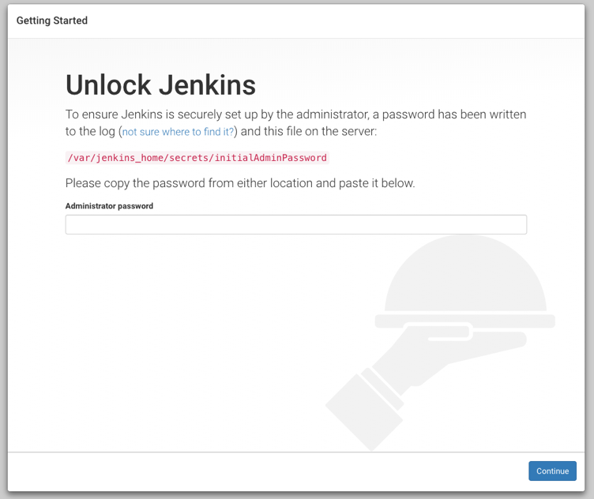

# 簡介
是一個自動檢查程式碼與編譯程式碼後，`批改`, `統計`, `測試` 的系統。

主要為調用Jenkins與Gitlab的API服務, 且將整個系統用到的服務 **容器化** 運行。

# 建置流程教學
## 首先確認server是否有docker-compose與docker工具
```
docker-compose  
docker -v
```
## 初步建置步驟
1. 在linux系統中clone [ProgEdu專案](https://github.com/fcumselab/ProgEdu), 的develop分支

`git clone --depth 1  --branch developer --single-branch https://github.com/fcumselab/ProgEdu.git`

2. 將env-example文件另外複製一份後， 改名成`.env` (注意是 "點 env" ), 它將用來設定機密資料。
接著需要編輯 `.env` 做以下設定
*  要一起更改 `DB_PASSWORD` 和 `DB_ROOT_PASSWORD` ,這兩個變數值必須一樣。
*  修正 `GITLAB_HOST=http://example.com:22080` 成 
   `GITLAB_HOST=http://{你電腦的IP地址}:22080`。(22080 需要與 `.env` 裡的 `GITLAB_HTTP_PORT`設定一致)
*  如上一步 去修正其它像右邊這種特徵的網址 `http://example.com` 成實際上ProgEdu要架設到的地方
3. 在專案的根目錄執行`sudo docker-compose up -d` 
4. 初步建置步驟結束,接下來需要個別設定 Gitlab 和 Jenkins 的一些權限，這樣ProgEdu才能跟這兩個服務連動

## **設定 Gitlab 流程**
### 1. 登入
用瀏覽器依照 `.env`裡的 `GITLAB_HOST` 的網址進入Gitlab，
使用者名稱為root，密碼為 `GITLAB_ROOT_PASSWORD`對應的值
### 2. 複製Gitlab Token
右上方頭像進入 > `Settings` ,在右邊導覽列找到 `Account Tokens`後， 
全部權限打勾，接著按下產生**Gitlab Token** 
這是用來讓 ProgEdu 可以對 Gitlab 控制的設定
，而ProgEdu的設定都源自於`.env`
所以想當然要去`.env`設定 
`WEB_GITLAB_ADMIN_PERSONAL_TOKEN = {Gitlab API Token}`
將 `{Gitlab API Token}` 替換 **token** (提醒: 大括號要拿掉)

## **設定 Jenkins 流程**  

1. 依`.env`的`WEB_JENKINS_URL`所設定的網址進入Jenkins 
2. 解鎖Jenkins

(備註 解鎖Jenkins需要進入容器查看 initialAdminPassword 檔案) 以下是進入容器方法
```
docker exec -it (YOUR_JENKINS_hash) bash 
cat /var/jenkins_home/secrets/initialAdminPassword
``` 
(備註: exec 是指進入容器, -it是指用互動模式, YOUR_JENKINS_hash 是指定哪個容器, bash 是指開啟容器內的bash程式。 cat 是顯示檔案內容用的指令)

3. 安裝plug-in 選擇"Install suggested plugins"
  

4. 填上使用者資訊 
  

這裡的名稱 跟密碼 設定必須跟 `.env` 的設定 一致
所以你要先查看你的`.env` 把你設定的帳密填入以下兩行
```
WEB_JENKINS_ADMIN_USERNAME=yaya
WEB_JENKINS_ADMIN_PASSWORD=password
```
然後一直下一步，就會完成初步的Jenkins架設流程。
還剩幾步驟是為了拿權限。

5. 拿取**Jenkins Token** 
因為ProgEdu要跟Jenkins做溝通 所以需要 **Jenkins Token**

右上角點選 `使用者名稱 > 設定 > API Token > Add new Token > Generate > 複製Token > 儲存`
  

拿到**Jenkins Token**後要去設定 `.env` 檔
`WEB_JENKINS_API_TOKEN={Jenkins Token}`(提醒: 大括號要拿掉)

6. 開啟讀取權限
因為ProgEdu需要用它提供的API來讀取`Jenkins`建置完成的檔案。

`管理jenkins > 設定全域安全性中 > 打勾 Allow anonymous read access > 儲存`


7. 設定**Gitlab API Token**

因為jenkins也必須要跟Gitlab請求程式碼，所以必須給他gitlab的token。

7_1. `管理Jenkins > 設定系統` 找到 Gitlab後，
先把(Enable authentication for ... connection) 的勾取消
 
7_2. 設定 Connection name = gitlab

7_3. 設定 Gitlab host URL 為`.env`文件設定的 gitlab 網址
  

7_4. 設定 Credentials:  如下步驟
1. 按 Add > Jenkins
2. Kind = Gitlab API token
3. Scope = Glibal
4. API token填上 你之前存在`.env`的**Gitlab Token**
5. ID = gitlab_api
   
6. 新增後把Credentials 換成 `GitLab API token` 
7. 點擊Test Connection測試是否成功
8. **儲存**
9. 可以在jenkins -> Credentials 發現你剛剛設定的憑證

10. 設定Gitlab憑證
    
`Credentials > System > Global credentials (unrestricted) > Add Credentials`

- Username：Gitlab root username (在你剛剛設定的.env找)
- Password：Gitlab root password (在你剛剛設定的.env找)  
- ID: 必須是 **gitlab_root**  


**全部設定結束後，儲存.env檔，然後要重新下 `docker-compose up -d` 指令，目的是用新的設定重新建置一次**
## 測試系統建置成功
1. 進入 `.env` 的 `WEB_EXTERNAL_URL` 的網址
2. 輸入帳號: root, 密碼: `.env` 的`GITLAB_ROOT_PASSWORD`的值
3. 可以測試創使用者後, 會發現GitLab也會新增一個使用者
4. 詳細功能目前還沒有文件來說明， 待之後補上

## 推薦開發ProgEdu的重要工具
* MobeXterm => 用ssh來連線linux
* GitKraken => 版本控制
* Postman => 測試web API功能
* MySQL workbench => 用來查看資料庫

## 學習過程推薦
1. Docker > Docker Compose > MySQL > RESTful API >  GitLab > Jenkins > JAVA > Maven > NodeJS > NPM 
