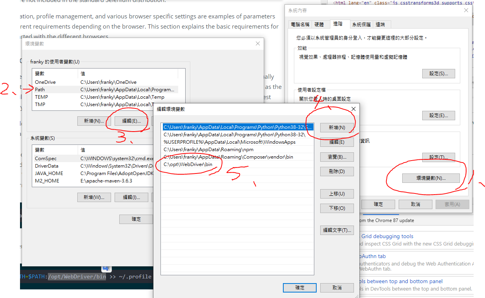

# BDD test 操作說明
## 如何運行
1. 先到[這裡](https://chromedriver.storage.googleapis.com/index.html)下載 Selenium 的 Chrome Driver, 版本必須跟本地的 Chrome 一致
2. 可以在C槽創建  `/opt/WebDriver/bin` 資料夾, 並把 `chromedriver.exe` 放進去bin資料夾中, 所以他的路徑為`C:/opt/WebDriver/bin/chromedriver.exe`
3. 設定環境變數 如下範例, 第二步要選path, 再到第三步按編輯, 接著第四步新增時 輸入 `C:\opt\WebDriver\bin` , 則會看到如編號5的環境變數被新增

4. 關閉所有CMD視窗, 包括VScode中的CMD也算, 則新的環境變數設定 才會生效
5. 使用 `cd front` 切換到 front 資料夾, 
6. `npm i` 安裝套件
7. `npm run bdd_test` 運行BDD test

